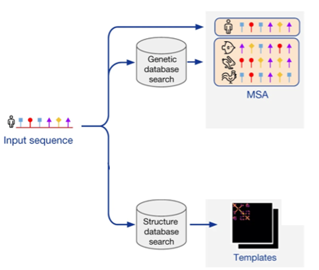
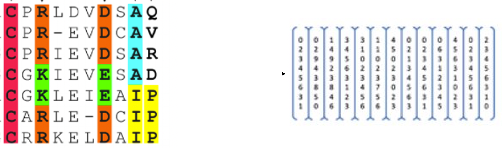
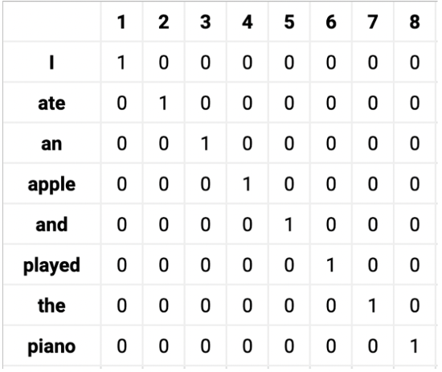
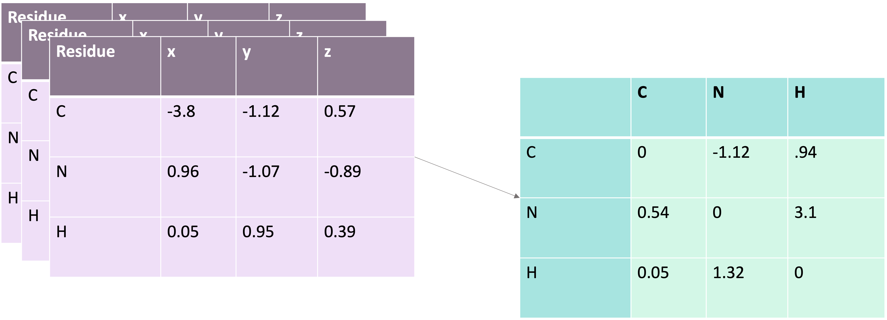

## AlphaFold2 Pre-Processing

Let's talk a bit about how AlphaFold2 go from a protein FASTA file to a full structure prediction.

## Searching for Similar Sequences

- This query sequence is compared to:
    - **UniRef90 database** to find similar sequences 
    - **PDB70** to find similar structures
- Sequences that are too similar to our query are filtered out so that we don’t just build a replicate based on that sequence
- These sequences are arranged as an MSA

## Multiple Sequence Alignment (MSA)

- An MSA is an array of sequences
- These sequences are _aligned_ with one another as to best match similar regions
- These sequences don’t always line up perfectly and as such we see:
    - Conserved positions: where the letter does not change
    - Coevolved positions: where the letter will change with another letter
    - Specificity Determining positions: where the letter is consistently different 

## Why is an MSA Useful In Structure Prediction?

- The theory is that residues that coevolve are generally close to each other in the protein’s folded state
- So, by assessing what residues change together we get an idea of where they might be spatially!

## MSA Embedding

- An MSA is still essentially an array of letters 
- To be more computer friendly these letters are _embedded_ as numbers using their positional information
- AlphaFold embeds these letter values as numeric ones and terms this the MSA representation

## Embedding Example

- Take for example the sentence “I ate an apple and played the piano”
- This string is  embedded by positional information. 
- e.g. ate was the second word so there is a 1 in the second column at row “ate”

## Pair Representation

- Similar Structures were also queried for using our protein sequence.
- These structure files (A.K.A Crystallographic Information Files (CIF)) contain 3D coordinates for a protein’s atoms in space
- These coordinates are used to initialize a pairwise distance matrix between residues that AlphaFold calls the pair representation

