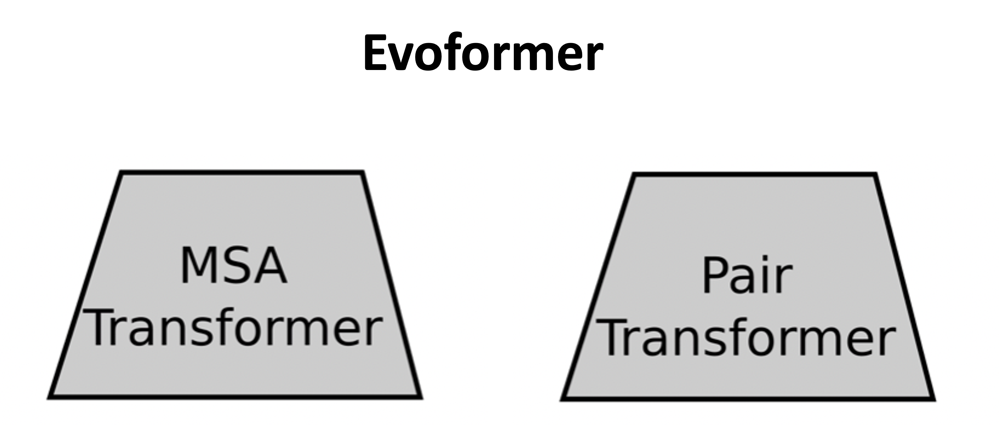
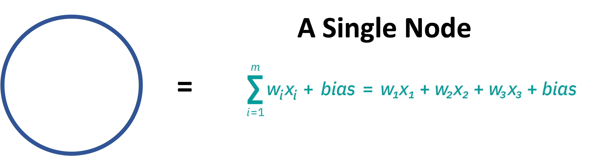
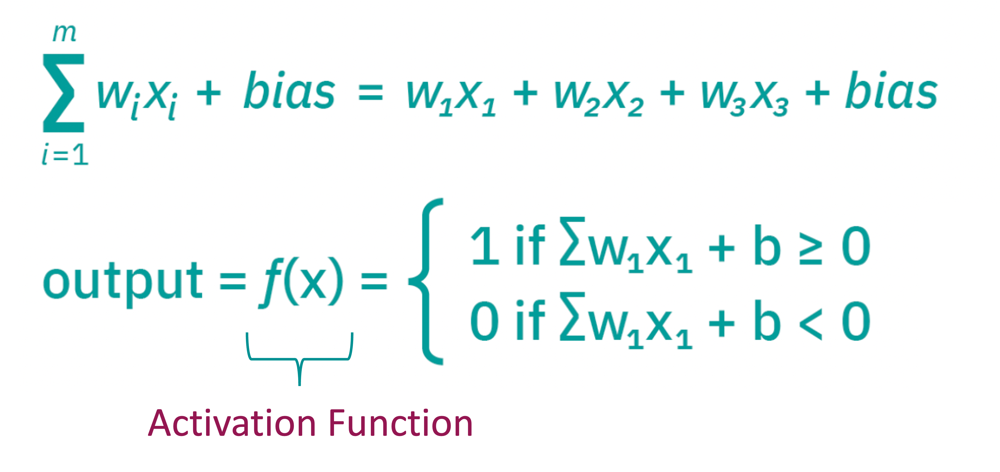
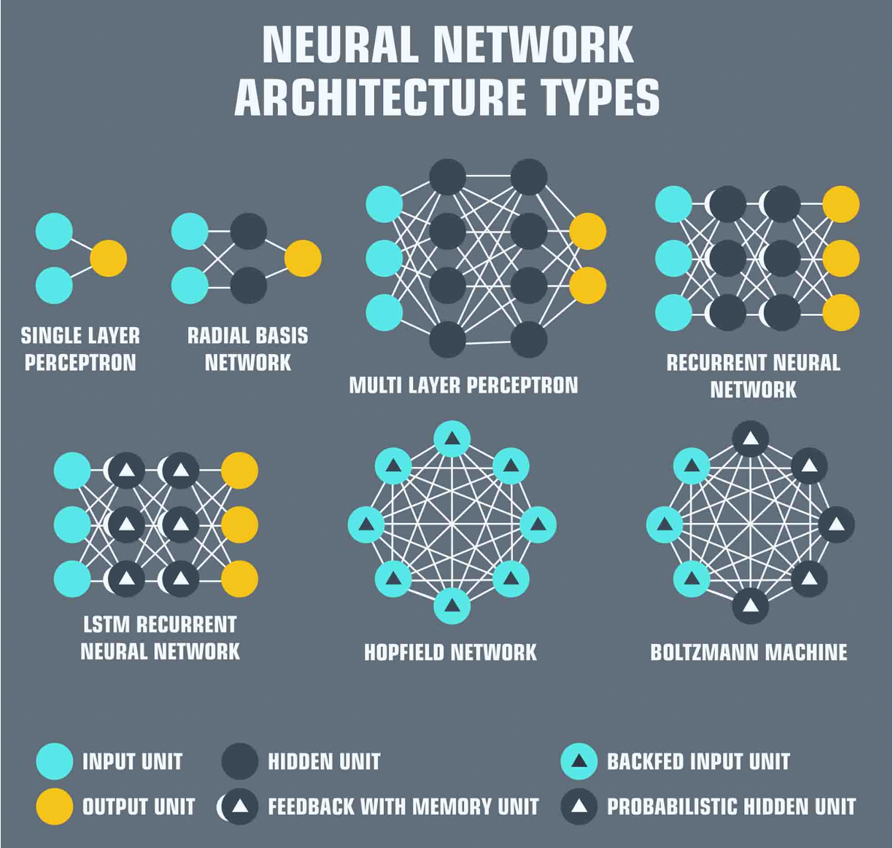
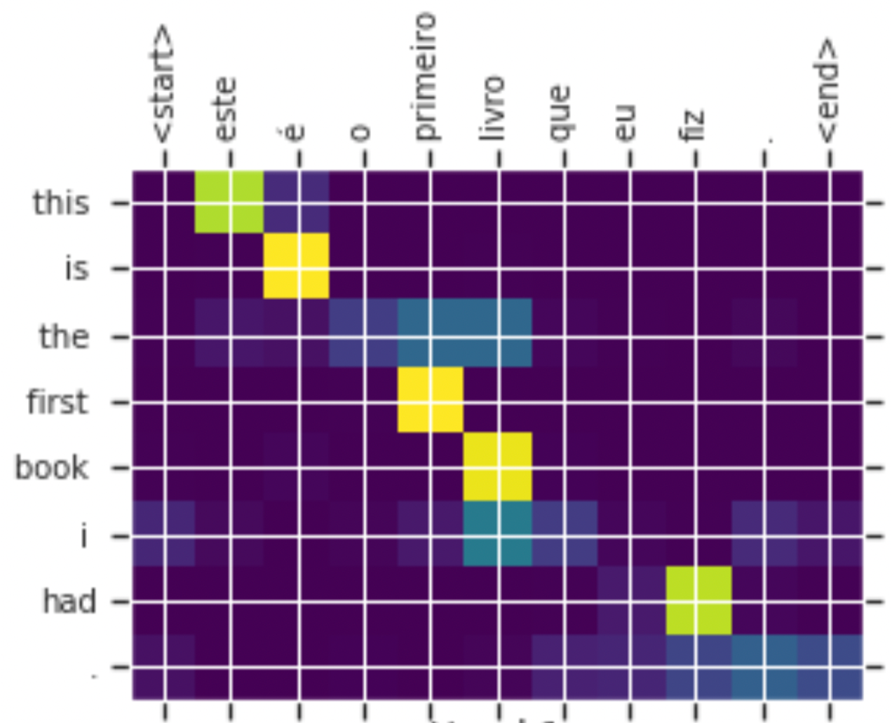
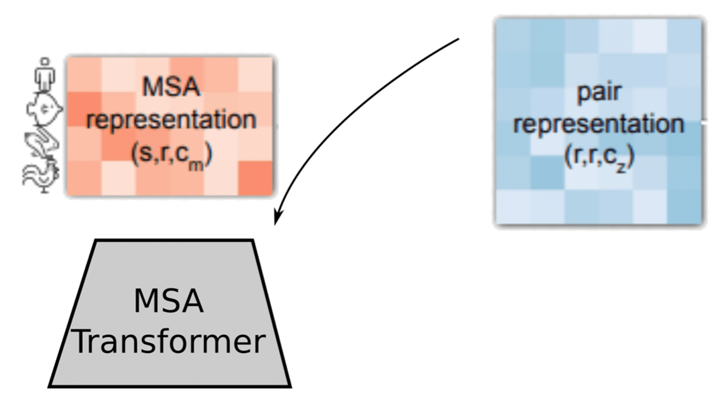
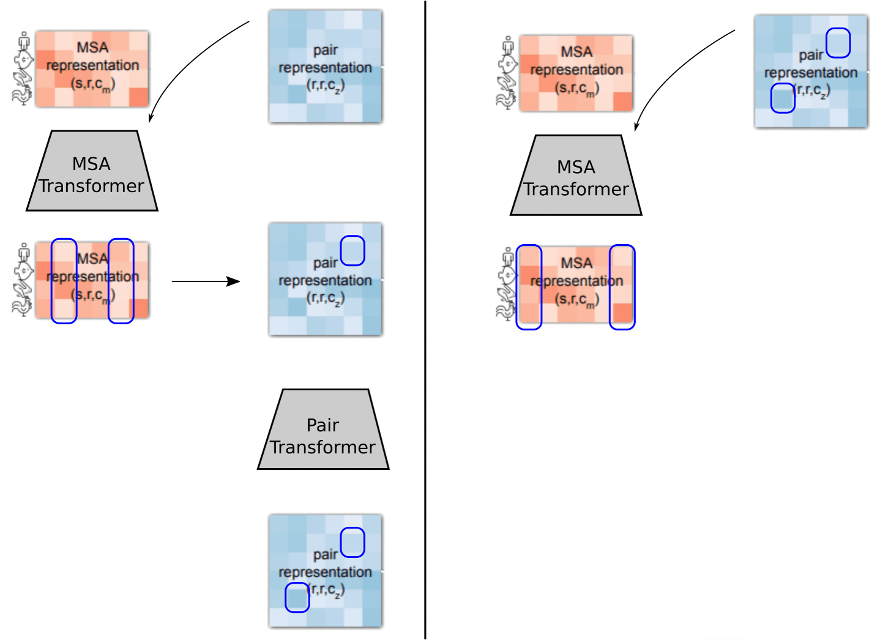
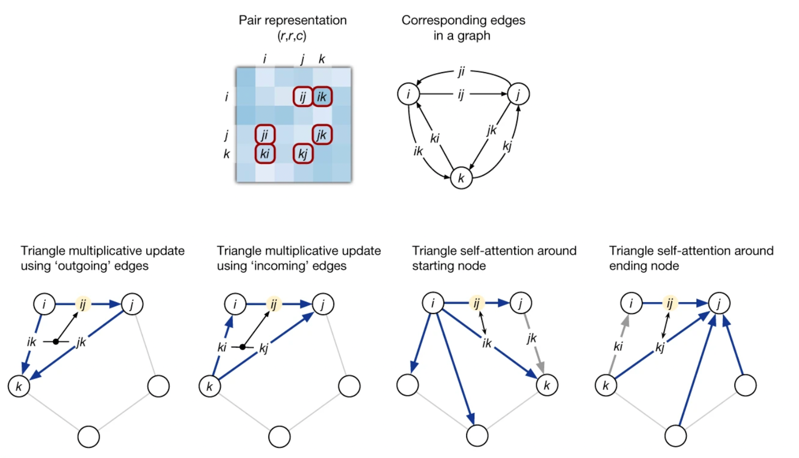
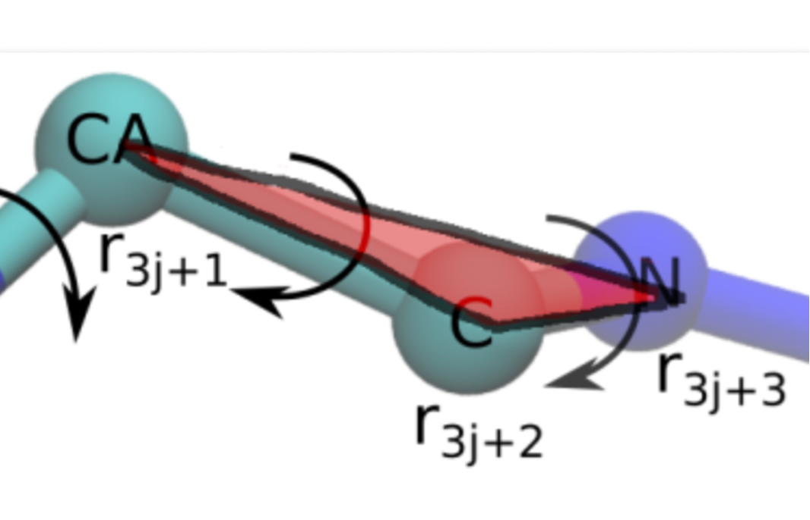
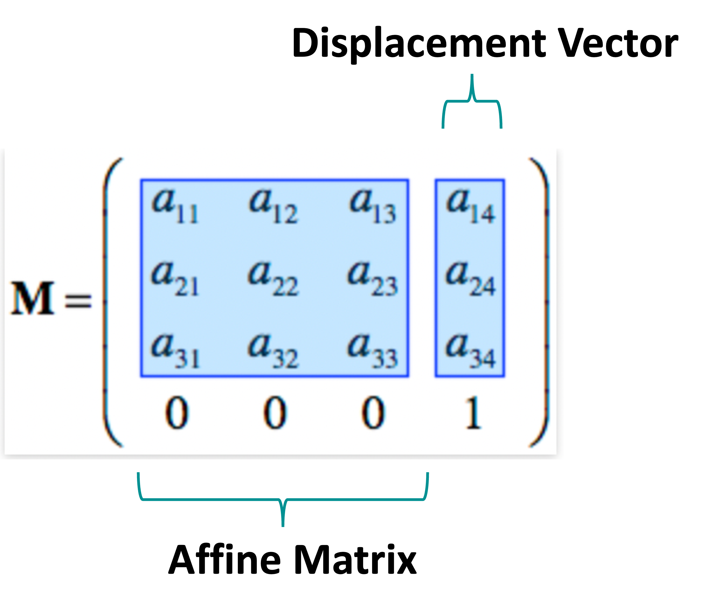

## The Evoformer

- The MSA representation and the pair representation are fed into in special type of neural network that AlphaFold terms the Evoformer
- The Evoformer is a combination of two special types of neural networks called Transformers

## What Are Neural Networks?

- Neural Networks are machine learning algorithms that mimic the way neurons communicate
- They usually consist an input, hidden and output layer
- Each node has a threshold and if the output of the node isn’t above that threshold it doesn’t communicate with the next node

## What Is In A Node?

- Each node can be thought of as a linear regression model with input data, weights, a bias term and an output
- The weights are assigned as to weight importance – the larger the weight the more important the variable

## To Communicate Or Not Communicate?

- Each node will have an output based on this regression function
- That output is then fed into something called an activation function
- The output of this activation function is compared to some threshold
- If the threshold is met it ”fires” and communicates with the next layer

## Neural Network Customization

- There are different types of neural networks depending on what functions you use and how you organize node communication
- AlphaFold uses a Recurrent Neural Network

## Recurrent Neural Network

- In a feed forward neural network you have input that is processed through a node and if that node is activated it communicates with the next node
- In a recurrent neural network, the output of a node can be used to inform and change the output of the node
- Naturally, this comes at a memory cost when it tries to pull from old connections

## Transformer And Attention

- To save on computational cost, Recurrent Neural Networks can have their attention limited
- Basically, values are scaled down to reveal which data points are worth paying attention to
- This focused recurrent neural network is called a Transformer

## MSA Transformer

- The MSA Transformer limits its attention two ways:
- Row-wise: to determine which residues are most related
- Column-wise: to determine which sequences are most important
- The limited MSA along with the Pair Representation are then fed into the first head of the Evoformer

## Evoformer Part 1

- The first block of the Evoformer works to determine how close residues are 
- start with correlations between two sets of residues, say A and B
- Highly correlation indicates these residues are close
- Now process is iterated - residue C is correlated with B
- So, B and C are close
- This process is repeated for all residues

## Evoformer Part 2

- The second block of the Evoformer works through pair wise distances between residues
- Here 3 residues are compared, and triangle inequality is enforced
- So, one side of the triangle must be less than or equal to the other two sides

## Structure Module

- The Evoformer outputs distances between residues, but residues are themselves three dimensional objects
- How are they oriented?
- Each residue starts as a “residue gas” or triangle between the Alpha Carbon, R-group Carbon, and the Nitrogen

- All residue gases start at the origin of the coordinate system
- Each position is defined as an affine matrix, or xyz coordinates for the three points of the triangle, which is multiplied by a displacement vector to "move" the residue gas to  its final location

## Invariant Point Attention

- The Structure Module also uses an attention mechanism called Invariant Point Attention
- This limits the data the model needs because points in 3D space are invariant to translation/rotation 
- Basically, this means that no matter how you rotate/translate the final structure you still produce the same answer
