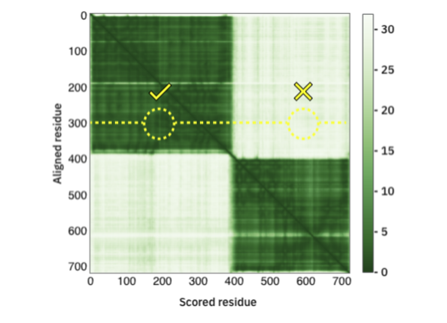
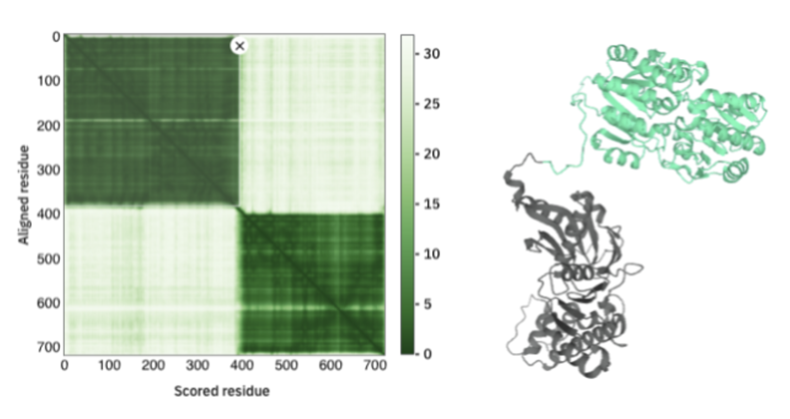
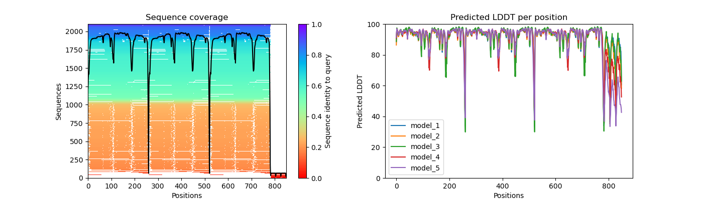
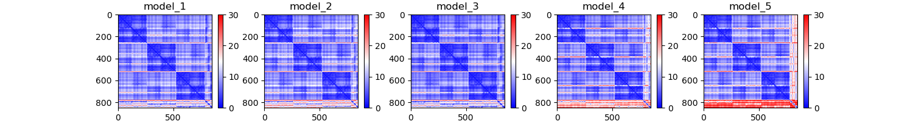
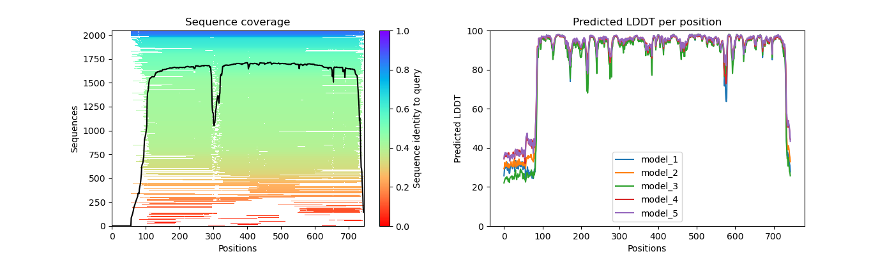
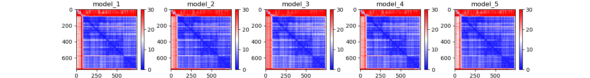

## AlphaFold Output

 - Here we predicted the structures of PCNA and LIG1. Let's examine the output by navigating to the PCNA output folder:
 
 ```bash
 cd af2Workshop/pcna/1AXC/
 ls 
 ```
 - You should see output that looks like the following:

!!! info ""

    ```
    features.pkl  pcna_ranked_1.pdb  pcna_ranked_4.pdb                  relaxed_model_2_multimer.pdb  relaxed_model_5_multimer.pdb  result_model_3_multimer.pkl  timings.json                    unrelaxed_model_3_multimer.pdb
    msas          pcna_ranked_2.pdb  ranking_debug.json            relaxed_model_3_multimer.pdb  result_model_1_multimer.pkl   result_model_4_multimer.pkl  unrelaxed_model_1_multimer.pdb  unrelaxed_model_4_multimer.pdb
    pcna_ranked_0.pdb  pcna_ranked_3.pdb  relaxed_model_1_multimer.pdb  relaxed_model_4_multimer.pdb  result_model_2_multimer.pkl   result_model_5_multimer.pkl  unrelaxed_model_2_multimer.pdb  unrelaxed_model_5_multimer.pdb
    ```
 
 - Where:
 
|File/Directory|Description|
|-|-|
|features.pkl|A pickle file w/ input feature NumPy arrays|
|msas|A directory containing the files describing the various genetic tool hits that were used to construct the input MSA.|
|unrelaxed_model_\*.pdb|A PDB file w/ predicted structure, exactly as outputted by the model|
|relaxed_model_\*.pdb|A PDB file w/ predicted structure, after performing an Amber relaxation procedure on the unrelaxed structure prediction|
|ranked_\*.pdb |A PDB file w/ relaxed predicted structures, after reordering by model confidence (using predicted LDDT (pLDDT) scores). ranked_1.pdb = highest confidence ranked_5.pdb = lowest confidence|
|ranking_debug.json|A JSON file w/pLDDT values used to perform the model ranking, and a mapping back to the original model names.|
|timings.json|A JSON file w/times taken to run each section of the AlphaFold pipeline.|
|result_model_\*.pkl| A pickle file w/ a nested dictionary of the various NumPy arrays directly produced by the model: StructureModule Output, Distograms, Per-residue pLDDT scores, predicted TMscore, predicted pairwise aligned errors |

## Assessing AlphaFold2 Accuracy 

- We can assess the accuracy of the AlphaFold prediction using:
    - **Predicted Local Distance Difference Test (pLDDT)**
    - **Predicted Alignment Error**

### Predicted Local Distance Difference Test (pLDDT)

- per-residue confidence metric  ranging from 0-100 (100 being the highest confidence)
- Regions below 50 could indicate disordered regions


### Predicted Alignment Error (PAE)

- The color at (x, y) corresponds to the expected distance error in residue x’s position, when the prediction and true structure are aligned on residue y.
- So, in the example below:
    - The darker color indicates a lower error
    - When we are aligning on residue 300, we are more confident in the position of residue 200 and less confident in the position of residue 600



- The example in the above came from a multimer prediction
- Here we see that the error is higher when assessing the position between the two chains:



## Plotting Structure Prediction Information

- We can leverage the `pkl` files to gain insight into our structure predictions. To do so we use a python script provided by the [VIB Bioinformatics Core](https://elearning.bits.vib.be/courses/alphafold/lessons/alphafold-on-the-hpc/topic/alphafold-outputs/) which we call `vizaf2.py`. First we will need to move back up one directory and load the AlphaFold module so that we have the packages needed to run our script.

```bash
cd ../../
```

```bash
ls
```

- You should then see the following output:

!!! info ""

    ```
    data  lig1  lig1af2.sh  pcna  pcnaaf2.sh  plotaf2.ipynb  vizaf2.py
    ```

To run our script we will need to load some tools first. We can load tools on the cluster by loading what are called modules. To load the module we will need, go ahead and enter the following command:

```bash
module load alphafold/2.1.1
```

- Now we will need to feed our script three arguments:
 - `--input_dir` input directory with model files mentioned above
 - `--output_dir` output directory to put our plots of model information
 - `--name` optional prefix to add to our file names

```bash
python vizaf2.py --input_dir pcna/1AXC/ --output_dir pcna/visuals/ --name pcna
```

- Running this will generate two images in your output directory:
 - `pcna_coverage_LDDT.png` - plots of your msa coverage and pLDDT scores per residue per model
 - `pcna_PAE.png` - plots of your predicted alignment error for each of your models

### pcna_coverage_LDDT.png



### pcna_PAE.png



- Now that we have these plots for the PCNA structure prediction, let's run this on the LIG1 prediction as well!

```bash
python vizaf2.py --input_dir lig1/1X9N/ --output_dir lig1/visuals/ --name lig1
```
### lig1_coverage_LDDT.png



### lig1_PAE.png




