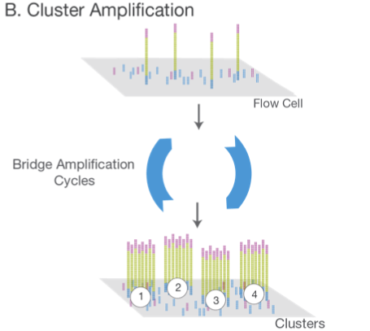

## Background

Sequencing data analysis typically focuses on either assessing DNA or RNA. As a reminder here is the interplay between DNA, RNA, and protein:

### DNA Sequencing

- Fixed copy of a gene per cell 
- Analysis goal: Variant calling and interpretation

### RNA Sequencing

- Copy of a transcript per cell depends on gene expression
- Analysis goal: Differential expression and interpretation

!!! note
    Here we are working with RNA sequencing
    
## Next Generation Sequencing

Here we will analyze a DNA sequence using next generation sequencing data. Here are the steps to get that data:

- **Library Preparation:** DNA is fragmented and adapters are added to these fragments

- **Cluster Amplification:** This library is loaded onto a flow cell, where the adapters help hybridize the fragments to the flow cell. Each fragment is then amplified to form a clonal cluster

- **Sequencing:** Fluorescently labelled nucleotides are added to this flow cell and each time a base in the fragment bonds a light signal is emmitted telling the sequencer which base is which in the sequence.

- **Alignment & Data Analysis:** These sequenced fragments, or **reads**, can then be aligned to a reference sequence to determine differences.

## Singe End v. Paired End Data

- **single-end** sequence each DNA fragement from one end only
- **paired-end** sequence each DNA fragement from both sides. Paired-end data is useful when sequencing highly repetitive sequences.
        

